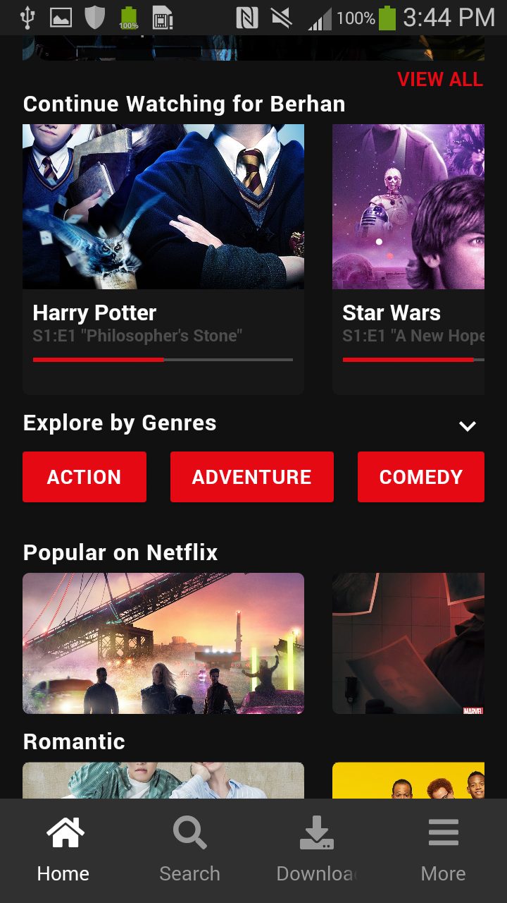

# Netflix UI Redesign usong Flutter

This is the home and login page of the Netflix app.

I have used two eternal dependencies

1. FontAwesome
   - it has a bunch of useful icons
2. Carousel_slider
   - used to slide list of items at a constant interval

